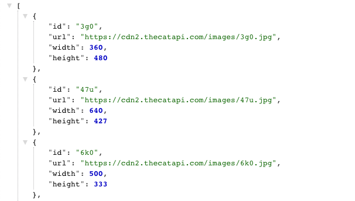
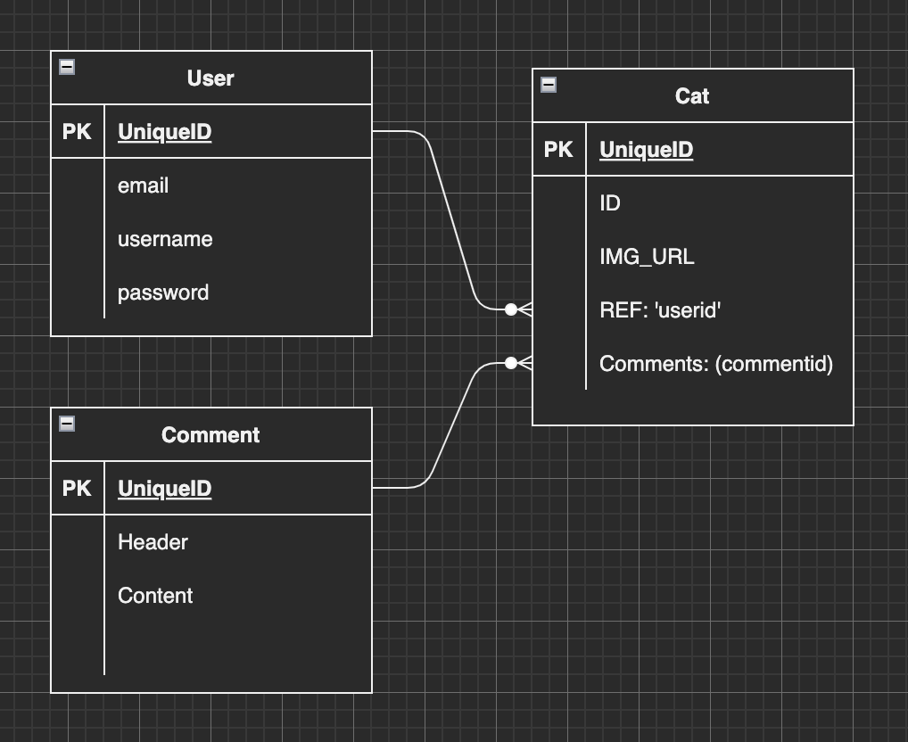
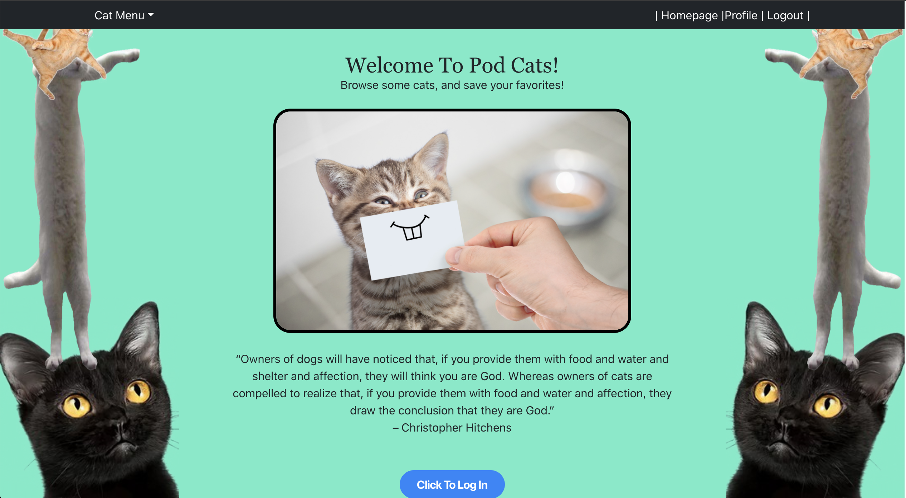
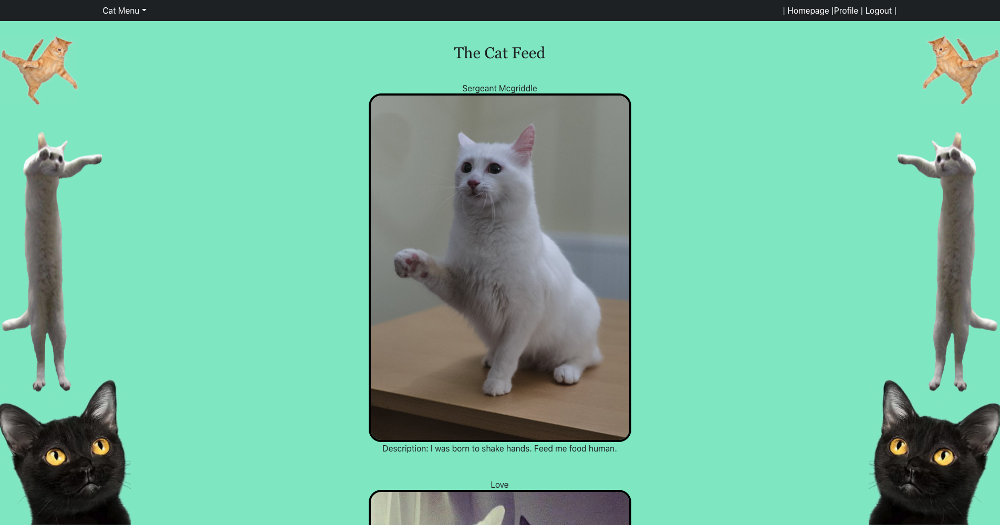
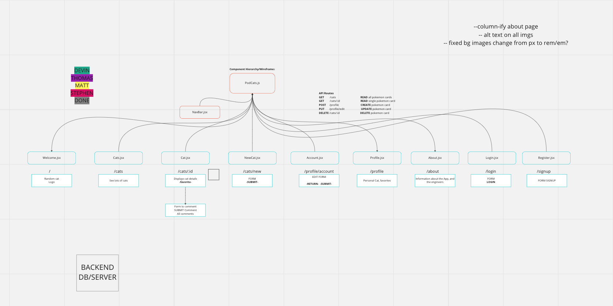

# Pod Cats

## Application Link
https://silver-beignet-215e62.netlify.app/

## Project Idea and Descriptions

Pod Cats is a social media and educational application designed for your pet cat. This online application will allow cat owners to post and share pictures of their cute and diabolical best friend. Additionally users will be able to view posts from other cat enthusiasts.

## Choice of API and proof of concept

https://api.thecatapi.com/v1/images/search?limit=10



## ERDs


## Application Site




## Restful Routing Chart

#### Users

| Method | URL pattern | Action | Description |
|:------:|:-----------:|:------:|:-----------:|
| GET    | /signup | Read | Render form for creating new User |
| POST   | /signup | Create | Create new user |
| GET    | /login | Read | Render form for users to log in |
| POST   | /login | Read | Verify user login info |
| GET    | /logout | Read | Log out user and user cookie id |
| GET    | /profile | Read | Display user info and user cat posts |
| GET    | /profile/account | Read | Render form for updating user information |
| PUT    | /profile/account | Update | Edit/update user information |
| DELETE | /profile/account | Delete | Delete user from DB |

#### Cat
| Method | URL pattern | Action | Description |
|:------:|:------:|:------:|:-----------:|
| GET    | /cats | READ | Render a feed of all (recent) cat posts |
| GET    | /cats/id/:id | Read | Display specific cat post |
| DELETE    | /cats/id/:id | Delete | Delete a specific cat post |
| GET    | /cats/new | READ | Render form for a new cat post |
| POST   | /cats/new | CREATE | Create a new cat post |


## Techstack
* React (Front-End Framework)
* Axios (NPM Package to retrieve data from API)
* React-Router-Dom (Front-End Framework)
* jwt-decode (Backend token decoder)
* Bcrypt (Backend, password hasher)
* Bootstrap (CSS Package)
* Tailwind (CSS Package)
* CSS 
* Javascript
* MONGODB (Backend Server)
* Dotenv (Backend Environment)
* Cors (Middleware for backend and frontend)
* Node
* Express (Display backend data through simple html)
* Rowdy (Server configuration library)
* Mongoose (Backend Server node module package)

## Wireframes


## General Approach

As a team, we decided to divide and conquer and use the Miro application to our advantage. Miro allowed us, as a group, to visually display who was working on a specific application component. Additionally, we used daily meetings to set goals and discuss priorities.  We found that effectively communicating contributed to our overall success. 

During the first couple of days Stephen spent a considerable amount of time focusing on the backend and making sure the server would communicate with the front end. Additionally, Devin, Matt and Thomas all contributed to the front end components and stubbing out all the necessary views. 

Once our server was up and running, we all worked individually and sometimes as a team to polish our components in the front end. Reaching MVP took the majority of the time alotted for this project. However, once we reached MVP, we spent the last day working together to learn integrating CSS with both Bootstrap and Tailwind packages.


## Server Installation Instructions
https://github.com/syorn96/pod-cats-server

To run Pod Cats on your local machine, first fork and clone this repository. Then follow these steps:

* In your terminal, navigate to the cloned repository. Run the command ```npm -install```  or  ```npm i```
to install all of the packages needed to run the app.

* You will need to add a gitignore file for your node modules. In your terminal in the same location as above, run the following command: ```node_modules >> .gitignore```
* In the ```.gitignore``` file, add ```.env``` to keep environmental variables off of github

* In the ```.env``` file, you need to set your ```PORT``` variable and your ```JWT_SECRET``` (this can be whatever you want). Enter the following:
 ```
JWT_SECRET='<whatever secret>'
PORT=8000
 ``` 

* You're all set! run ```nodemon``` in your cloned repository and your server is ready to go.
* Make sure your client is running as well
* Enjoy!

## Client Installation Instructions
https://github.com/KhakiSuitValentino/pod-cats-client

To run Pod Cats on your local machine, first fork and clone this repository. Then follow these steps:

* In your terminal, navigate to the cloned repository. Run the command ```npm -install```  or  ```npm i```
to install all of the packages needed to run the app.

* You will need to add a local file for functionality. In your terminal in the same location as above, run the following command: ```touch .env.local``` 
* In the ```.gitignore``` file, add ```.env.local```

* In the ```.env.local``` file, you need to set your router variable. Enter the following:
 ```
 REACT_APP_SERVER_URL=http://localhost:8000
 ``` 

* You're all set! run the command ```npm run start``` in your cloned repository and your client is ready to go.
* Make sure your server is running as well
* Enjoy!


## Userstories
* As a user I want to be able to create an account
* As a user I want to be able to create a new cat post (image, caption, header)
* As a user I want to be able to comment on other cat owner posts
* As a user I want to be able to remove a cat post from my profile
* As a user I want to learn more about cat breeds
* As a user I want to see a LOT of cat pictures
* As a user I want to be able to edit my existing account details (display name)


## MVP Goals
* Create an account
* Ability to log in and log out
* Ability to post pictures of your cat
* Functioning Routes


## Stretch Goals
* Allow users to share posts with other users in a feed
* Available Cat adoption?
* Cat articles, facts (third API)
* Allow users to comment on cat posts
* Edit favicon
* Limited feed of posts, unless users scroll to display additional posts 

## Major Hurdles
We ran into several issues as we dove deeper into this group project. The most apparent was getting our front/back ends to pass the correct data between each other. Mob-coding worked extremely well in our group to collaboratively break down and solve our issues with a collective mind. Our confidence grew with each tackled issue and provided some great momentum in what felt like a very fast project week. We're proud to deploy Pod-Cats, and we hope you smile using the application as much as we did developing it!
